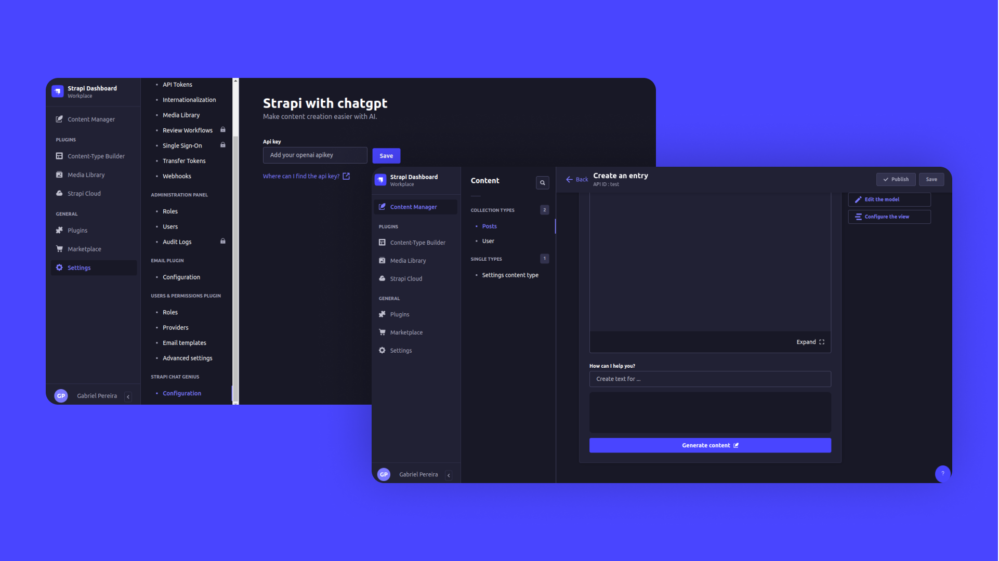

<a id="readme-top"></a>
<div align="center">
  
</div>
<div align="center">
  <h1>Strapi Chat Genius - Strapi V4 Plugin</h1>
  <p>This project consists of a plugin for strapi to add the text generation field with the chatgpt api. Making content creation easier!</p>
</div>

<div align="center">
  
  
  
  
</div>

# 📌 Table of contents
<details>
  <summary>Open table</summary>
  <ol>
    <li><a href="#-about-the-project">About the project</a></li>
    <li><a href="#-requirements">Requirements</a></li>
    <li><a href="#-instalation-steps">Instalation Steps</a></li>
    <li><a href="#-configuring-plugin">Configuring plugin</a></li>
    <li><a href="#-contributing">Contributing</a></li>
    <li><a href="#-about-me">About me</a></li>
  </ol>
</details>

# 📚 About The Project

<div align="center">
  
</div>

<br/>

The heart of this project lies in its ability to enhance content creation within the Strapi framework. By incorporating the ChatGPT API, users gain access to a powerful text generation tool, opening doors to a world of possibilities for creative and efficient content development.

## 🌠 Features

- <strong>Text Generation Field:</strong>
The plugin introduces a specialized text generation field within Strapi, allowing users to harness the capabilities of the ChatGPT API directly. This field becomes an integral part of content types, enabling dynamic and on-the-fly text creation.

- <strong>Seamless Integration:</strong>
Integration with the ChatGPT API is smooth and intuitive. Users can seamlessly incorporate generated text into their content without the need for complex workflows. The process is designed to be user-friendly, catering to both novice and experienced Strapi users.

- <strong>Enhanced Creativity:</strong>
With the ChatGPT-powered text generation, content creators can break free from creative constraints. The plugin becomes a valuable asset for generating diverse and engaging content across various domains, from marketing materials to blog posts.

- <strong>Effortless Implementation:</strong>
The project is engineered to be easily implemented within existing Strapi installations. Whether you're a developer looking to enhance a project or a content creator seeking a more dynamic workflow, this plugin provides a hassle-free solution.

# 📝 Requirements 

Complete installation requirements are exact same as for Strapi itself and can be found in the documentation under [Installation Requirements](https://docs.strapi.io/developer-docs/latest/getting-started/introduction.html).

**Minimum environment requirements**

-   Node.js `>=14.19.1 <=18.x.x`
-   NPM `>=6.x.x`

In our minimum support we're following [official Node.js releases timelines](https://nodejs.org/en/about/releases/).

**Supported Strapi versions**:

-   Strapi v4.15.5 (recently tested)
-   Strapi v4.x

> This plugin is designed for **Strapi v4** and is not working with v3.x.

**We recommend always using the latest version of Strapi to start your new projects**.

# ⏳ Instalation Steps
Follow these steps to install the Strapi Chat Genius plugin:

1. Run this code in a the project terminal
```
yarn add strapi-chat-genius
```
or also using npm
```
npm install strapi-chat-genius 
```
2. Add a this code to a file ```./config/plugin.ts``` or ```./config/plugin.js``` to enable plugin.
```
export default {
  ...
  'strapi-chat-genius': {
    enabled: true
  },
  ...
}
``` 

# ⚙️ Configuration plugin
1. To configure plugin, you go to a ```settings/strapi-chat-genius/configuration```, and add a apikey from **openai**.
   


<a href="https://platform.openai.com/api-keys">Where can i find the apikey?</a>

2. Add a custom field in your content type that you wish
   
  
  
3. Now you can use the **strapi chat genius** plugin

  

## 🤝 Contributing

Contributions are what make the open source community such an amazing place to learn, inspire, and create. Any contributions you make are **greatly appreciated**.

If you have a suggestion that would make this better, please fork the repo and create a pull request. You can also simply open an issue.
**Don't forget to give the project a star! Thanks again!**

1. Fork the Project
2. Create your Feature Branch (`git checkout -b feature/AmazingFeature`)
3. Commit your Changes (`git commit -m 'Add some AmazingFeature'`)
4. Push to the Branch (`git push origin feature/AmazingFeature`)
5. Open a Pull Request

## 👨🏻‍🚀 About me
"Connect with me on LinkedIn to explore my career path and collaborate on amazing projects."
<table>
  <tbody>
    <tr>
      <td align="center" valign="top" width="14.28%"><a href="https://www.linkedin.com/in/gabriel-mendonca-pereira/"><br /><sub><b>Gabriel Mendonça Pereira</b></sub></a><br />
    </tr>
  </tbody>
</table>

<p align="right">(<a href="#readme-top">Back to top</a>)</p>

 


